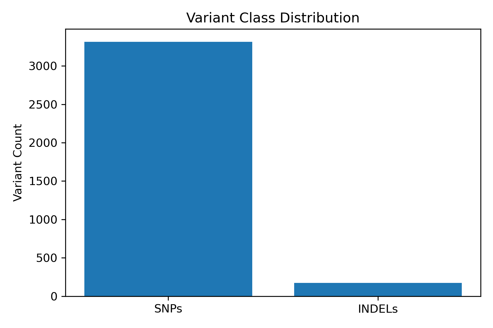
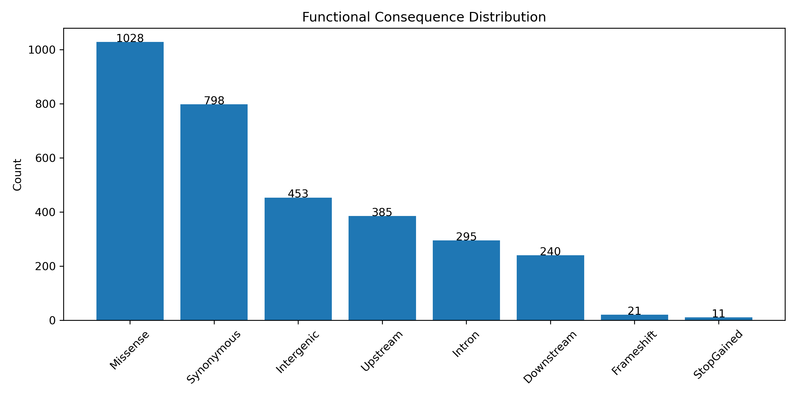

# Whole Exome Sequencing (WES) Variant Analysis Pipeline

## Project Overview

This project implements an end-to-end Whole Exome Sequencing (WES) analysis workflow using the benchmark NA12878 (GM12878) human exome dataset (SRR098401) from NCBI SRA.

The objective was to perform quality control, read alignment, BAM processing, germline variant discovery, and variant filtering following GATK Best Practices.

## Dataset

| Attribute | Value                  |
| --------- | ---------------------- |
| Sample    | NA12878 (GM12878)      |
| Accession | SRR098401              |
| Platform  | Illumina HiSeq 2000    |
| Strategy  | Whole Exome Sequencing |
| Layout    | Paired-End             |

## Workflow

Dataset Acquisition → FASTQ Generation → FastQC → MultiQC → fastp → BWA-MEM → BAM Processing → Read Group Addition → MarkDuplicates → HaplotypeCaller → Variant Filtering

## Tools Used

* FastQC
* MultiQC
* fastp
* BWA-MEM
* SAMtools
* GATK
* bcftools

## Challenges and Troubleshooting

### Missing Read Groups

GATK MarkDuplicates initially failed because the BAM header lacked Read Group (RG) information.

Resolution:

* Verified absence of RG records in BAM header.
* Added read groups using GATK AddOrReplaceReadGroups.
* Re-ran duplicate marking successfully.

This troubleshooting step improved understanding of GATK Best Practices and BAM metadata requirements.

## Status

Completed through variant discovery and filtering.

## Functional Annotation Results

Variants were annotated using SnpEff (GRCh38.115).

| Consequence Type | Count |
|------------------|------:|
| Missense Variant | 1028 |
| Synonymous Variant | 798 |
| Frameshift Variant | 21 |
| Stop Gained | 11 |
| Splice Region Variant | 86 |

### Key Observations

- Missense variants represented the largest functional class (1028 variants).
- 21 frameshift variants and 11 stop-gained variants were identified, representing potentially high-impact coding changes.
- Variant annotation enabled prioritization of protein-altering variants for downstream interpretation.
## High-Impact Variant Analysis

Functional annotation using SnpEff identified several HIGH-impact variants.

### Frameshift Variants
- GPATCH4
- MUC6
- GTF2H1
- OR8U1
- RAD52
- NPIPB2
- POLR2A
- LGALS9
- CYP2F1

### Stop-Gained Variants
- OR5AR1
- TAS2R46
- ALDH3A2
- NACA2
- PSG7
- LILRA2

### Key Findings

- 1028 missense variants identified
- 21 frameshift variants identified
- 11 stop-gained variants identified
- 3488 high-confidence variants retained after filtering
- 3315 SNPs and 173 INDELs detected
## Variant Class Distribution

## Functional Consequence Distribution

## Key Results

| Metric | Count |
|---------|-------:|
| Raw Variants | 75,717 |
| Filtered Variants | 3,488 |
| SNPs | 3,315 |
| INDELs | 173 |
| Missense Variants | 1,028 |
| Synonymous Variants | 798 |
| Frameshift Variants | 21 |
| Stop-Gained Variants | 11 |
